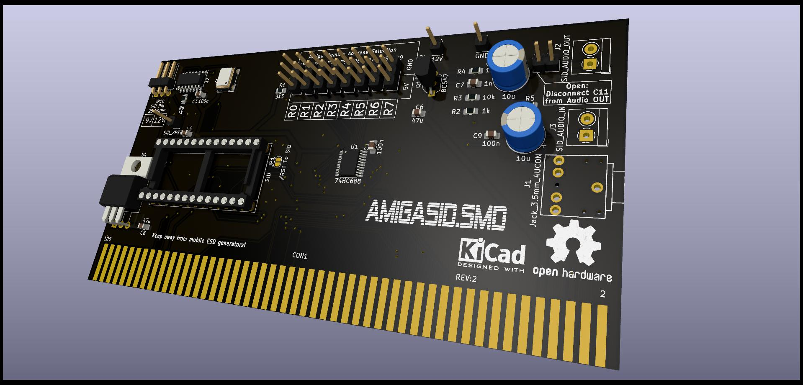
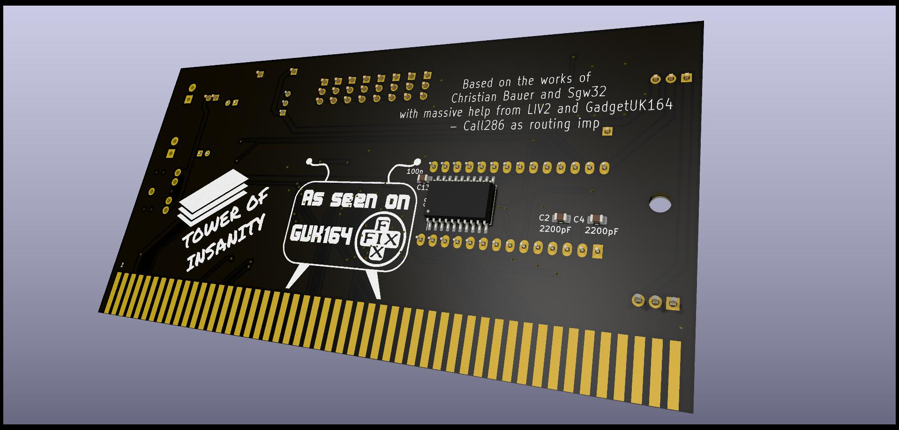

# AmigaSID Zorro II card

Board Render Front           |  Board Render Back
:-------------------------:|:-------------------------:
 | 

[Schematic PDF](Hardware/AmigaSID-schematic.pdf)

Forked from https://github.com/Sgw32/AmigaSID which forked from http://www.amibay.com/showthread.php?108629-Amiga-SID-player-for-Zorro-slot

Can't find the original thread on Amibay sadly, so i can't do full credits here.

## Changes

- Changed most of the components to SMD, major rerouting.
- Added 100k pull down resistor and 470pF capacitor to EXT_IN of SID like pointed out at the original schematics.
- Added 245 buffer to D0-D7 databus lines.
- Changed crystal to 7050 part.
- Tied Amiga /RST to RST of SID via solderjumper (default connected)
  - can be removed with a cut and be used at A4k with it's power LED connected to H1
- Added 8 jumpers (JP2-JP9) to set the memory address the SID can be accessed from the player side (needs patched player to use that address)
- Added filter caps to vcc lines of the IC's
- Changed audio connector to a more common type
- Moved filter caps closer to IC's
- Added logo
- Floating 74LS00 inputs tied to VCC
- Flipped polarity on C10 (SID_AUDIO_IN)
- Added jumper to disconnect audio out cap from output pins
  - instead you now can fit a little amp board like shown Gadgets video about the original version of the card
  - also added one GND and one 12V pin for powering the amp

Thanks to [LIV2](https://github.com/LIV2) and [GadgetUK](https://www.youtube.com/channel/UCRBWJ9JeJ3Q8ssn_ibii-Cg) for the help in this project.

Use at your own risk!!!

## Jumper setting

The bank of jumpers on top of the card (JP2-JP9) is used to set the memory address used by the card and the players.

Jumper setting for EE range:

| Jumper  |   Setting    |
| :------:|:-----------: |
| JP2     |  1-2 (LOW)   |
| JP3     |  2-3 (HIGH)  |
| JP4     |  2-3 (HIGH)  |
| JP5     |  2-3 (HIGH)  |
| JP6     |  1-2 (LOW)   |
| JP7     |  2-3 (HIGH)  |
| JP8     |  2-3 (HIGH)  |
| JP9     |  2-3 (HIGH)  |

## Folder: Hardware

Here you'll find the KiCAD6 project for the board.
Also there is a HTML BOM for parts placement and a jlcpcb folder with gerbers and BOM/POS for assembly (only the SMD caps/resistors, no ic's or THT parts!)

## Folder: Software

Here you'll find patched versions of players to use on the Amiga.

## TODO
- Add more/better documentation